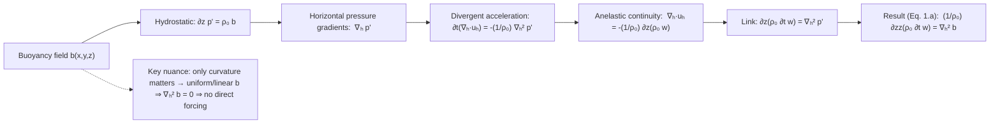
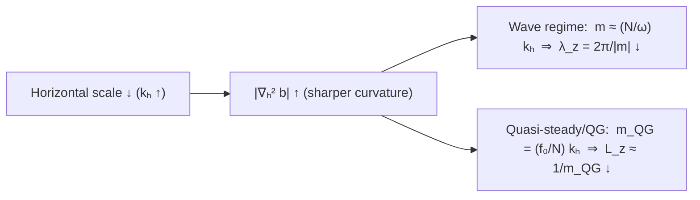

# Moisture-Stratiform Instability

File: Kuang_2008_-_A_moisture-stratiform_instability_for_convectively_coupled_waves.pdf
Page: https://journals.ametsoc.org/view/journals/atsc/65/3/2007jas2444.1.xml
Status: In progress

- Relevant Information
    
    Reference paper: 
    
    - Kuang, Z. (2008). A moisture-stratiform instability for convectively coupled waves. *Journal of the Atmospheric Sciences*, *65*(3), 834-854.
    - Kuang, Z., and C. S. Bretherton, 2006: A Mass-Flux Scheme View of a High-Resolution Simulation of a Transition from Shallow to Deep Cumulus Convection. *J. Atmos. Sci.*,  **63**, 1895–1909,  [https://doi.org/10.1175/JAS3723.1](https://doi.org/10.1175/JAS3723.1).
    
    Anelastic Note:
    
    [Anelastic & Boussinesq Approximation](https://www.notion.so/Anelastic-Boussinesq-Approximation-25570c23cf0980ee83bec3ab2736f3a0?pvs=21) 
    

# Propose

This mechanism is for understanding the instability mechanism of convectively coupled wave. 

# Model Design

## Response to convective heating

### Anelastic Assumption

$$
\left( \frac{\partial}{\partial t} + \epsilon \right) (\overline{\rho}w^\prime)_{zz} = -k^2 \overline{\rho} g\frac{T^\prime}{\overline{T}}  
\tag{1.a}
$$

$$
\frac{\partial}{\partial t} T^\prime + w^\prime \left( \frac{d\overline{T}}{dz} + \frac{g}{C_p} \right) = J^\prime \tag{1.b}
$$

The physical interpretation of these two equations:

For Eq. (1.a), the tendency of vertical mass-flux curvature is sourced from the horizontal distribution of buoyancy.

In equation (1.a), the equation is associated with wavenumber, and the relations between horizontal scale and vertical wavelength is like below:

For Eq. (1.b), it is quite straight forward. Local change of temperature is determined by diabatic heating and adiabatic cooling.

The deriving process is shown at [Appendix A. — Deriving Anelastic Equations](https://www.notion.so/Appendix-A-Deriving-Anelastic-Equations-25b70c23cf09805b98e8de6f632964a0?pvs=21). We further separate the anomalous field into the first two vertical modes with:

$$
\begin{cases}
& \overline{\rho}w^\prime = \sum_{j=1}^2 w_j (x, t) G_j(z)\\
\\
& \overline{\rho} T^\prime = \sum_{j=1}^2 T_j(x, t) G_j(z)\left( \frac{d\overline{T}}{dz}+\frac{g}{C_p}\right)\\
\\
& \overline{\rho} J^\prime = \sum_{j=1}^2 J_j(x, t)G_j(z)\left( \frac{d\overline{T}}{dz} + \frac{g}{C_p}\right)
\end{cases}
$$

And the equation can be written as:

$$
\begin{cases}
& \left( \frac{\partial}{\partial t} + \epsilon \right) w_j - k^2c_j^2 T_j = 0\\
\\
& \frac{\partial}{\partial t}T_j + w_j = J_j
\end{cases}\tag{3}
$$

### MSE tendency

$$
\partial_t h_b = E - b_1 J_1 - b_2 J_2
$$

In this study, we omit surface sensible heat flux, $E$, and assume that the sub-cloud layer MSE is governed by the adjustment of convection, which is parameterization of  convective heating.

According to the equation, this equation shows that the tendency, or change, of sub-cloud layer MSE will be adjusted by the convection.

### Mid-tropospheric moisture tendency

 

$$
\frac{\partial q_{mid}}{\partial t} = a_1 w_1 + a_2w_2 - d_1 J_1 - d_2 J_2 \tag{6}
$$

The reason why choosing mid-tropospheric moisture rather than using column water vapour to estimate the behaviour of the convection is more dominant by mid-tropospheric moisture deficit (Kuang and Bretherton 2006).

This equation tell is that the mid-tropospheric moisture is influenced by vertical motion and convectively heating of both the 1st and 2nd mode. For vertical motion, the way they influence the mid-tropospheric moisture is through vertical moisture advection. And for convective heating, the mid-tropospheric moisture is removed by convection behaviours.

To simplify this equation, we use a physical fact that the 2nd vertical mode has its node at mid-troposphere, which leads to vertical advection through the 2nd baroclinic mode.

## Convective Parameterisation

We first define convective heating in the upper and lower troposphere:

$$
\begin{cases}
	& U = (J_1 - J_2)/2\\
	\\
	& L = (J_1 + J_2)/2\\
\end{cases} \tag{8, 9}
$$

Assuming that the total upper-troposphere heating to the total lower-tropospheric heating is related to the anomalous moisture deficit:

$$
\frac{U_0+U}{L_0+L} = r_0 + \frac{r_q}{L_0} q^+
$$

$$
q^+ = q_{mid} - \frac{\pi}{2}T_1 \approx q_{mid} - 1.5 T_1
$$

The physical meaning of this equation is that given the lower-level convective heating , the drier the mid-tropospheric, the weaker the upper-troposphere convective heating is. We can further linearised this relation into:

$$
U=r_0L+r_q q^+ \tag{18}
$$

Additionally, we assume a strict quasi-equilibrium, i.e. the convective adjustment is instantaneously reached. We parameterise the tendency of sub-cloud layer with vertical mass fluxes:

$$
\frac{\partial h_b}{\partial t} = F\frac{\partial}{\partial t}[fT_1 + (1-f)T_2] \tag{14}
$$

Last, the evolution of convective heating will be controlled by relaxation of lower-level convective heating:

$$
\frac{\partial L}{\partial t} = \frac{L_{eq} - L}{\tau_L} \tag{17}
$$

The lower-level convective heating in equilibrium state can be written as:

$$
L_{eq} = \frac{Ar_q q^+ + f w_1 + (1-f)w_2}{B} \tag{15}
$$

$$
\begin{cases}
	& q^+ \equiv q - 1.5 T_1\\
\\
	& A\equiv 1-2f+\frac{b_2-b_1}{F}\\
\\
	& B\equiv 1+\frac{b_2+b_1}{F}-Ar_0
\end{cases}
$$

In this simulation, we will use Eq. (3), (6), and (17) as prognostic equations, and Eq. (8), (9), (15), and (18) are auxiliary equations.

The way we apply prognostics on this system is shown in [Appendix B — Linear Dynamic System](https://www.notion.so/Appendix-B-Linear-Dynamic-System-25d70c23cf0980a08a63e97185220c19?pvs=21). Additionally, this system can also be written in a form of parametric hormonic oscillator, the derivation is in [Appendix C — Parametric Harmonic Oscillator](https://www.notion.so/Appendix-C-Parametric-Harmonic-Oscillator-25e70c23cf098045a047f96a635cf256?pvs=21).

# Appendix

[Appendix A. — Deriving Anelastic Equations](https://www.notion.so/Appendix-A-Deriving-Anelastic-Equations-25b70c23cf09805b98e8de6f632964a0?pvs=21)

[Appendix B — Linear Dynamic System](https://www.notion.so/Appendix-B-Linear-Dynamic-System-25d70c23cf0980a08a63e97185220c19?pvs=21)

[Appendix C — Parametric Harmonic Oscillator](https://www.notion.so/Appendix-C-Parametric-Harmonic-Oscillator-25e70c23cf098045a047f96a635cf256?pvs=21)
